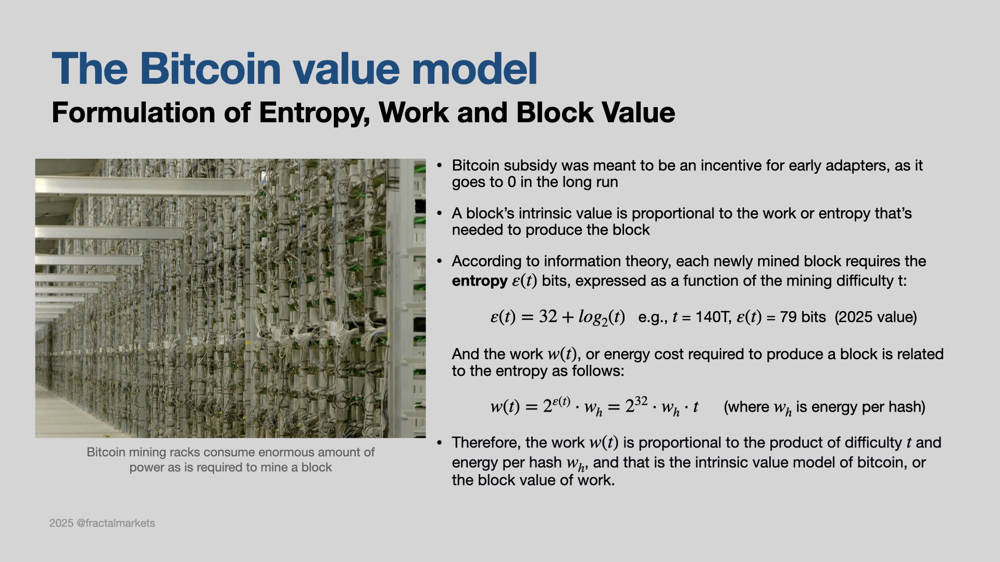
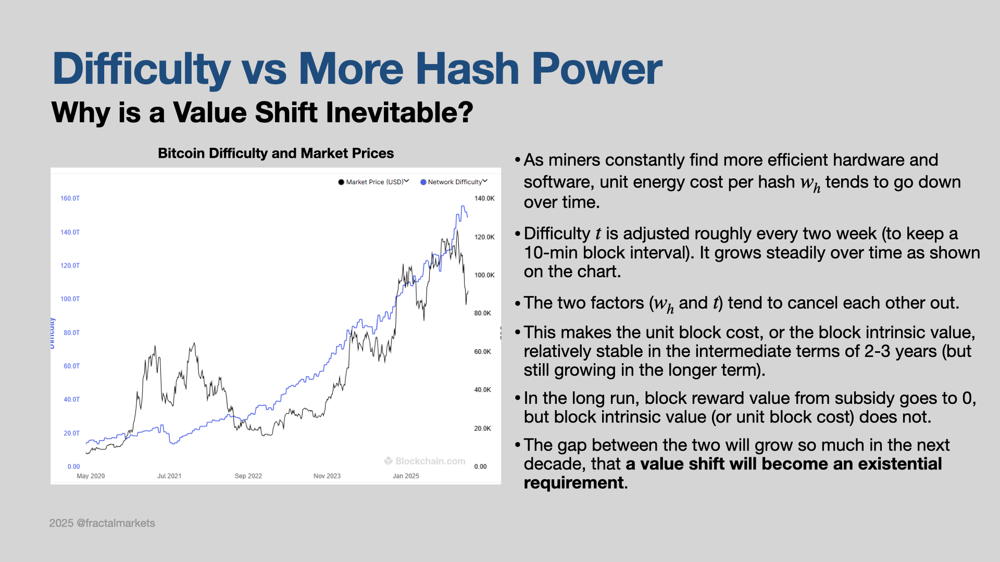
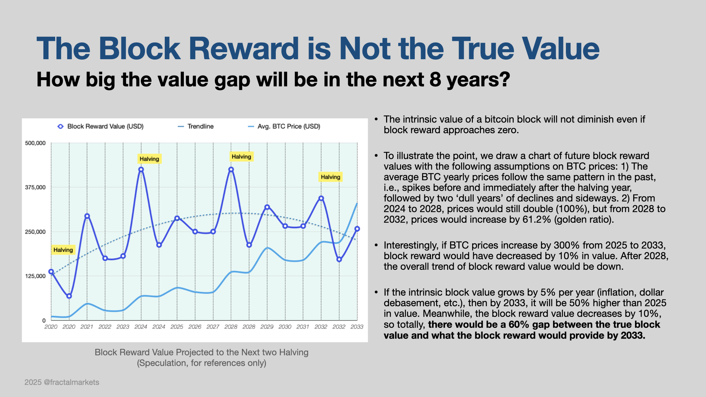
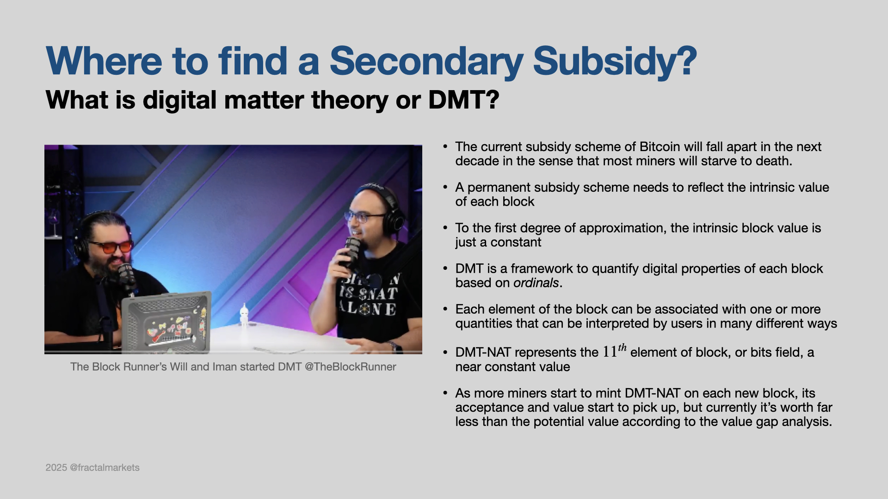

## The Bitcoin Value Model 

Let's first study the fundamentals of the BTC block. 

Next, we take a look at the difficulty and how it changes over the years. It definitely grows with time in the long term, but it also goes sideways in the intermediate time frame of 2-3 years.   

The gap between the block reward value and the true value of the block (or costs) will only grow bigger the bigger in the future. 

Imagine what will happen if there is a sudden cosmic storm that interrupts electricity all over the world. Are you able to sell a bitcoin if you absolutely have to? The answer is no, because the bitcoin network is down and nobody will be able to trade with you. This is different from gold. If you have a gold coin, you can trade it in some remote village with people for food and shelter, and no electricity is needed. This example shows that all the bitcoin hodlers are beneficiaries of the bitcoin network regardless if they have any transactions for any given period of time. However, the network can only charge users who actually send transactions in a given block, and those transaction fees are never meant to cover all the costs of running the network. That's why the network has been subsidized by minting the bitcoins. Therefore, the minted BTC is not a reward, but a necessary business subsidy for running the decentralized network. When the value of the minted BTC goes below the costs of producing a new block, a secondary subsisdy becomes absolutely necessary. 

See details at [Digital Matter Theory](https://digital-matter-theory.gitbook.io/digital-matter-theory/) 

[Prev](README.md)

