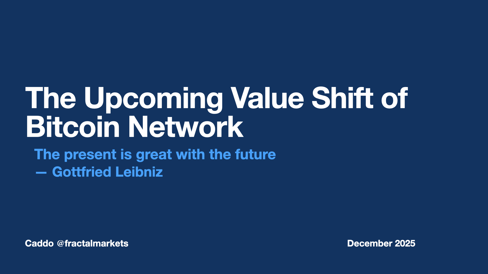
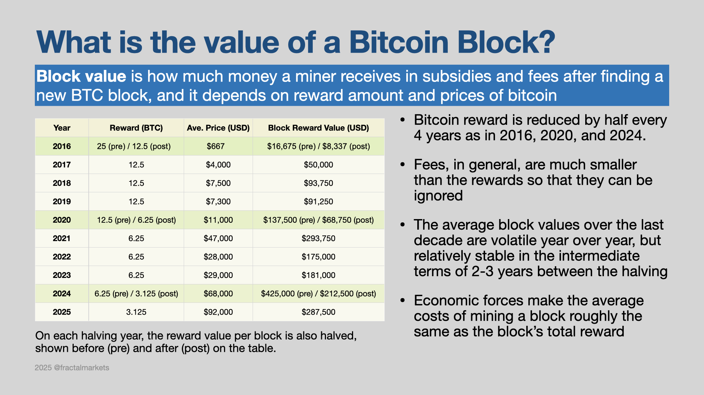
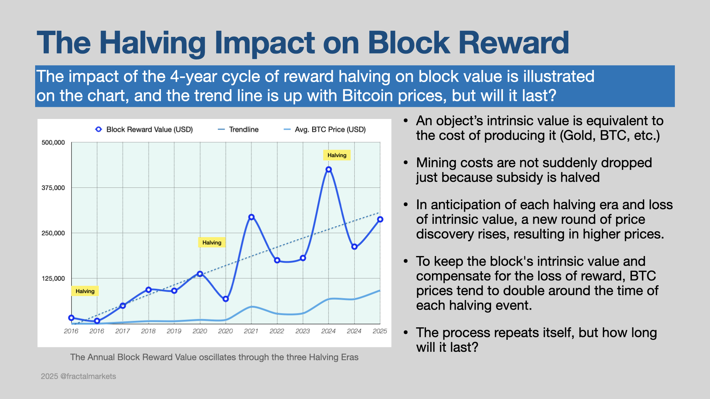
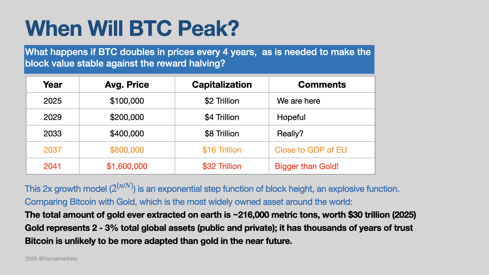

# The Value Shift of the Bitcoin Network

The bitcoin blockchain is the first crypto blockchain network, created by Satoshi Nakamoto, and it has been running non-stop since 2010. The bitcoin network consists of thousands of independent node operators (miners), who run server nodes, validate blocks and produce (or mine) new blocks. A reward scheme was designed so that each new block's builder is rewarded with a 'block subsidy', in the form of new bitcoin tokens (BTC). The amount of subsidized BTC is not kept constant, but rather desiged to be halved roughly every four years (known as reward era). 

The block subsidy is the primary source of income for the node operators. In the table, the BTC revenue is estimated as the product of the total BTC rewarded and the mid-price of BTC for that year. We don't know for sure the total costs of running the bitcoin network, but we know it has to be in the same order of magnitude as the total BTC revenue generated. 

The game cannot go on forever. In a few more reward eras, the BTC reward by each block is less than 0.1 BTC, but the costs of running the BTC network will likely continue to grow. 

Next, we will examine the upcoming value shift of the BTC network, and try to understand the required conditions and implications. 

### [The Value Gap of BTC](BtcPrice.md)

